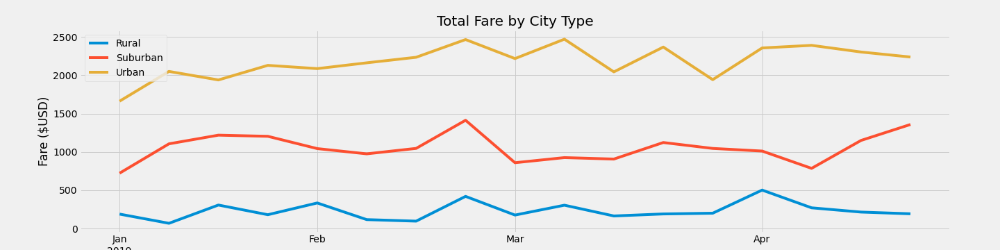

# PyBer_Analysis

## Overview of the Analysis
### Purpose
The purpose of this project is to summarizes how the data differs by city type and how those differences can be used by decision-makers at PyBer.

Per decision-maker's request, the below 2 deliveriables will be presented:
1. use python to create a summary DataFrame of the ride-sharing data by city type.
2. use Pandas and Matplotlib to create a multiple-line graph that shows the total weekly fares for each city type.

## Results
### Comparison between 3 city types:
  - **Rural** cities have the **least** amount of Total Rides, Total Drivers, and Total Fares. 
  - **Urban** cities have the **most** amount of Total Rides, Total Drivers, and Total Fares. 
  - **Suburban** cities are in between Rural and Suburban in terms of rides, drivers and fares.

### Total Fare by city type chart between Jan to Apr 2019
As we can see that the total fares for the Rural and Suburban markets are considerably lower than in the Urban markets. 

#### Conclusion 
From the above, we can come to the conclusion that :
1. **Less population** leads to the **highest costs** of fare per Ride and per driver.
2. **More pupolation** leads to the **lowest costs** of fare per Ride and per drive.

## Summary
To sum up of the analysis, below are the 3 suggestions for the business decision maker:
 - Improve the margin profit of Urban market by decreasing Urban drivers or increasing cost of riding. More population and usage means less earniing for the drivers and less profit.
 - Offer campigns to encourage drivers to work in Suburban and Rural citiesif they pick up riders in these 2 areas.
 - Offer different discount to riders who take rides from Urban to Rural/Suburban or from Rural/Suburban to increase the mobility between or 3 cities.
