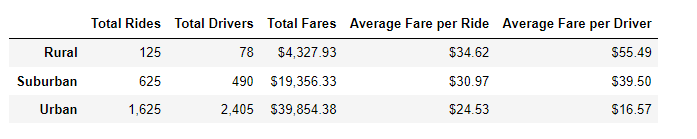

# PyBer_Analysis

## Overview of the Analysis
### Purpose
The purpose of this project is to summarizes how the data differs by city type and how those differences can be used by decision-makers at PyBer.

Per decision-maker's request, the below 2 deliveriables will be presented:
1. use python to create a summary DataFrame of the ride-sharing data by city type.
2. use Pandas and Matplotlib to create a multiple-line graph that shows the total weekly fares for each city type.

## Results
### Comparison between 3 city types:
  - **Rural** cities have the **least** amount of Total Rides, Total Dirvers, and Total Fares. 
  - **Urban** cities have the **most** amount of Total Rides, Total Dirvers, and Total Fares. 
  - **Suburban** cities are in between Rural and Suburban in terms of rides, drivers and fares.
**Less population** leads to the **highest costs** of fare per Ride and per driver.
**More pupolation** leads to the **lowest costs** of fare per Ride and per drive

### Total Fare by city type chart between Jan to Apr 2019

## Summary

There is a statement summarizing three business recommendations to the CEO for addressing any disparities among the city types
